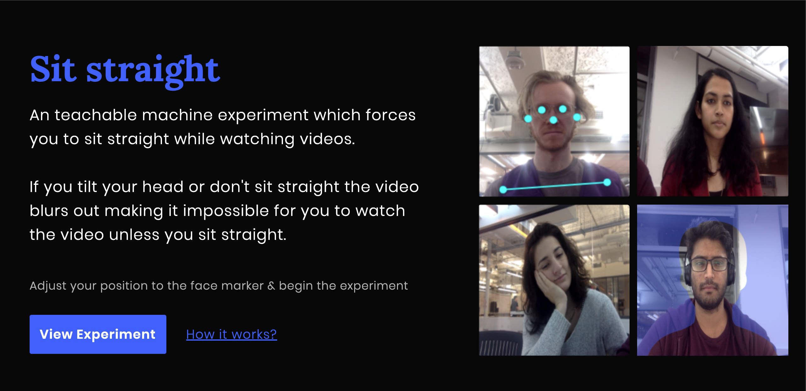
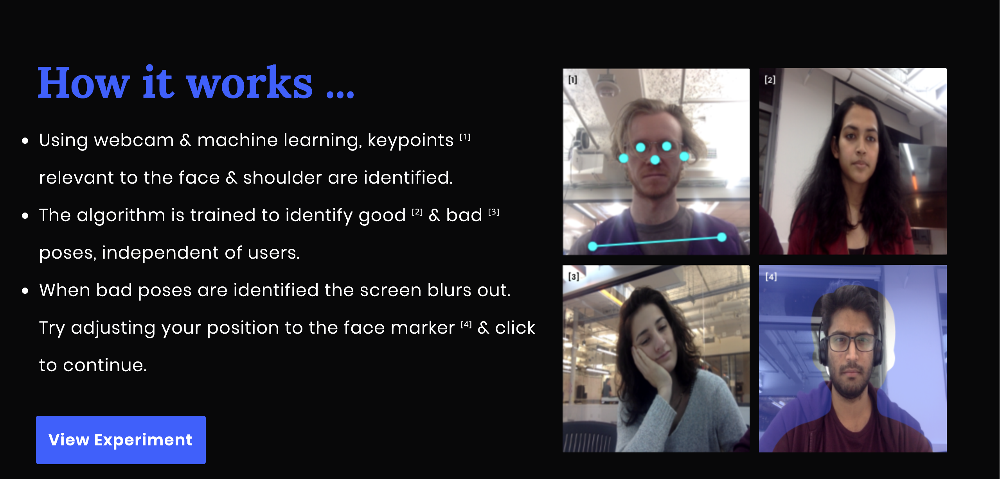
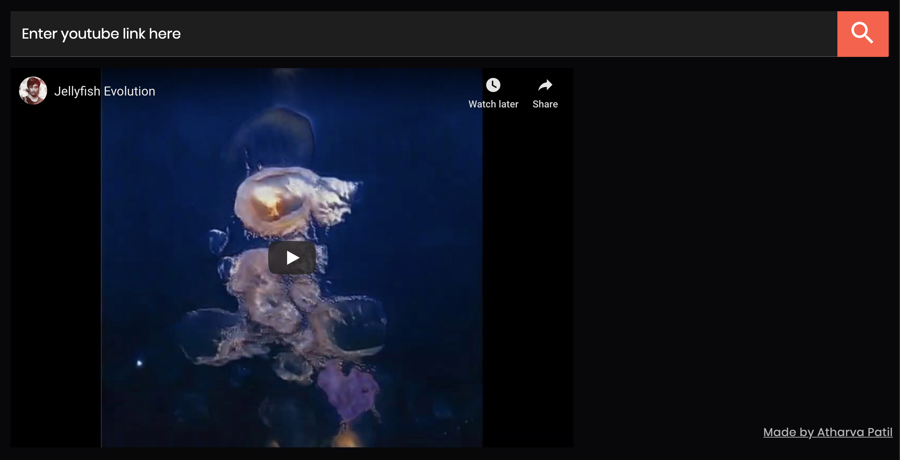

# Sit Straight

An PoseNet based experiment built using teachable machine by google. Users can view youtube videos by pasting links. By the browser will blur out the video in the users don't keep their head straight.

## [View the live demo](https://atharvapatil.github.io/teachable-browser/)

### Motivation
Every year in fall students study Introduction to Computational Media at ITP. Part of learning is watching tutorial videos which extend anywhere between 10 mins to a couple of hours. As the viewing progresses peoples posture starts slouching or takes many weird forms including sitting in weird angles, leaning over the table & more. With teachable machines pose classifier I saw an opportunity to enable conscious healthy seating choices in people by giving them feedback when they have a bad posture.

### Images from the application

##### Landing page

##### How it works ..

##### App without any blur when user sits straight.

##### App with  blur when user doesn't sit straight.

### Exhibit
Recently exhibited at the ITP Winter show 2019 on 15th & 16th December 2019.

### Thanks to
- Yining Shi.
- Cassie Tarakajian.
- Classmates & Colleagues(Especially Arnab & Cara).
- Teachable Machine community.
